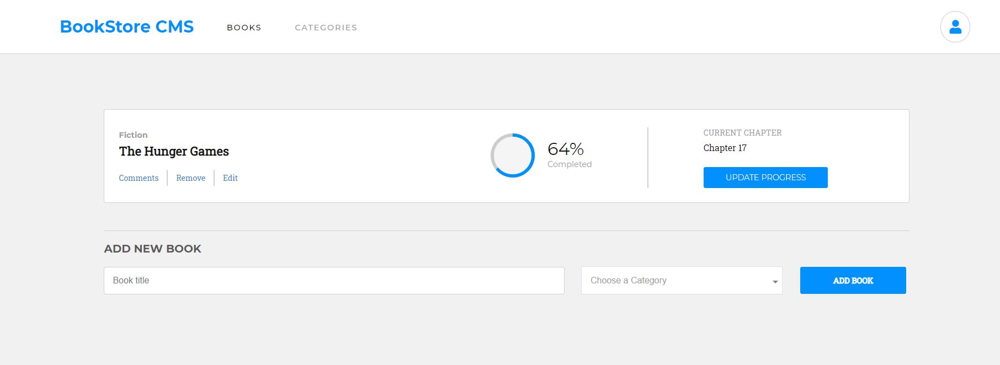

# BookStore

> The Bookstore is an MVP website from [ Zeplin project](https://app.zeplin.io/project/5b35a9e13227086040f8eb75/screen/5b695e29bb8c844f118f9378) that offers the following features:

- Display a list of books.

- Add a book.

- Remove a selected book.

## This project is built with: 

- React. 

- React Router.

- Redux. 

- Middleware.

- Thunk. 

- API.

- Components.

- CSS.
## Image Preview

## :star::star: [Live Demo](https://reverent-lumiere-3226bd.netlify.app/) :star::star:

## Getting Started

In order to get local copy up and running follow these simple example steps:

- On the project, GitHub page, navigate to the [main page of the repository](https://github.com/mrigorir/bookstore-app)

- Click on a button named `Code`

- Copy the project URL as displayed on HTTPS tab

- If you're running Windows Operating System, open your command prompt. On Linux, Open your terminal

- Change the current working directory to the location where you want the cloned directory to be made. Leave as it is if the current location is where you want the project to be.

- Type `git clone`, and then paste the URL you copied in Step 3. 

  `$ git clone https://github.com/mrigorir/bookstore-app` <em>Press Enter key</em> 

- Your local copy will be created.

- Please note that you must have Git installed on your PC, this can be done [here](https://gist.github.com/derhuerst/1b15ff4652a867391f03)

- After you get the project aiming to the desired directory, you need now to install ruby globally and follow the steps below:

### Github Actions

To make sure the linters' checks using Github Actions work properly, you should follow the next steps:

1. On your recently forked repo, enable the GitHub Actions in the Actions tab.
   
2. Create the `feature/branch` and push.
   
3. Start working on your milestone as usual.
   
4. Open a PR from the `feature/branch` when your work is done.

### Usage 

- Make sure you have npm and node installed in your terminal.

- I recommend the use of VS code as a code editor, but you can use whatever you want.

- Run `npm install` after you clone the project.

- Run in your terminal `npm start` OR `yarn start` to start React website.
  
## Author

👤 **Marco Parra**

- GitHub: [@mrigorir](https://github.com/mrigorir)
- Twitter: [@marcoparra311](https://twitter.com/marcoparra311)
- LinkedIn: [@marco-alonso-parra](https://www.linkedin.com/in/marco-alonso-parra/)

## 🤝 Contributing

Contributions, issues, and feature requests are welcome!

Feel free to check the [issues page](https://github.com/mrigorir/bookstore-app/issues).

## Show your support

Give a ⭐️ if you like this project!

## Acknowledgments

- Microverse Activities

## 📝 License

This project is [MIT](https://github.com/mrigorir/bookstore-app/blob/main/LICENSE) licensed.
